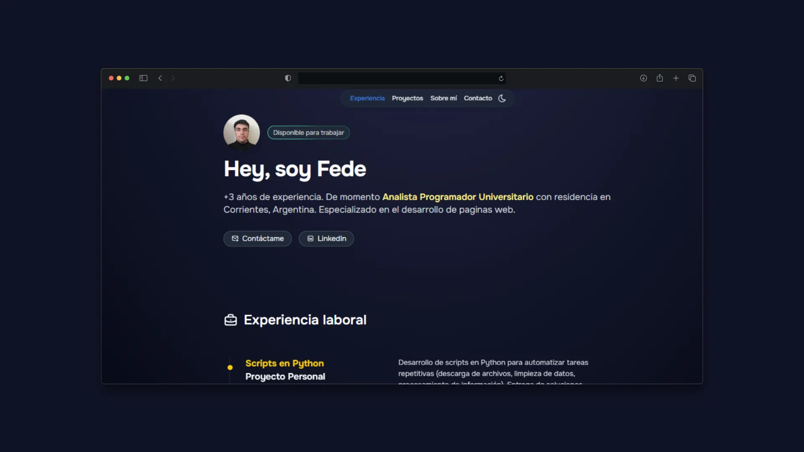

# 👨🏻‍💻 Hola, bienvenido a mi Porfolio

  

  <!-- Badges de tecnologías utilizadas -->
  
  

  <!-- Estadísticas de GitHub -->
  
  
  
  

  <!-- Funciones extra recomendadas -->
  
  
  
  

---

